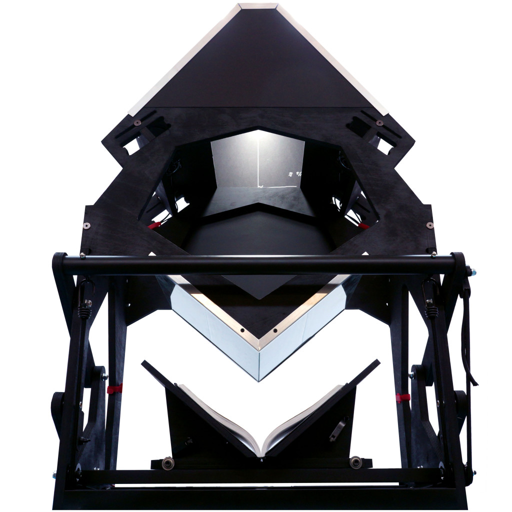

So there's this whole community of people archiving their own books, by building a DIY book scanner.

The main website for building this device is [diybookscanner](http://diybookscanner.org/archivist/index.html) which outlines the process of scanning and digitizing a book, complete with a Pi software suite.

Even [Gwern](https://gwern.net) has [tweeted about this](https://twitter.com/gwern/status/931927044358852610?lang=en) - not surprising considering he's big into the archiving scene. 

Another interesting fact from [this talk](https://vimeo.com/29184137) about DIY book scanning is that the [internet archive books](https://archive.org/details/internetarchivebooks) uploads a new scanned book every 90 seconds 📈  Great resource for the classics. 

The archivist DIY book scanner uses a two-camera setup to scan both pages simulataneously

Worth reading also is the page on [optics](http://diybookscanner.org/archivist/index322f.html?page_id=459)