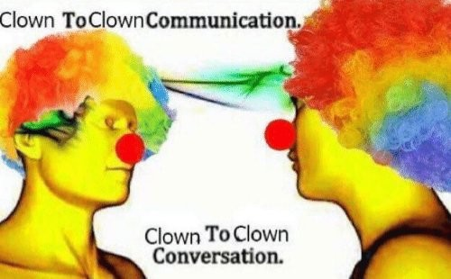

*[ [[Category - Anti-patterns]] ]*

### The anti-pattern

I've decided to call this antipattern a clown-to-clown conversation because that's what happens if you fall for it. I got the name from this meme: 

Although the memes don't really follow this particular anti-pattern. 

This happens in the comments section of math forums and stuff. I found it as a comment on r/badmath. 

One person thinks they're talking to someone smarter than them. To appear on their level, they build on everything the other is saying. Usually, this other person *also has a shallow understanding*, but this is non-obvious to an outsider.

The other, thinking about this engagement as intellectual continues the conversation.

The two of them have an absolute wack pseudo intellectual exchange where neither learns anything.

This faulty basis of conversation accumulates small errors into larger ones. 

### Solution

As with most things, [[humility is the mind-saviour]]. Do not pretend to know what you don't know. If you're caught in a clown to clown conversation, the best move is to humble yourself and leave.