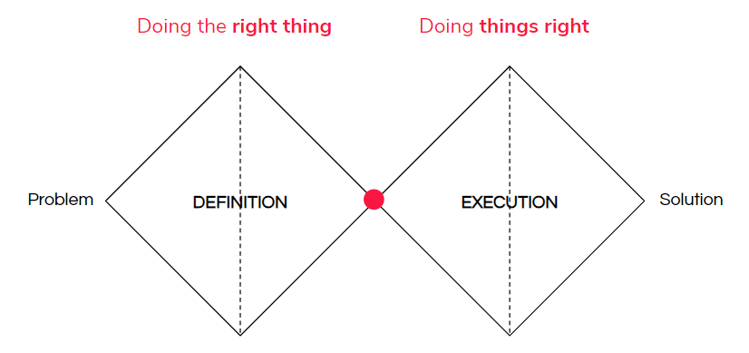

This is a [creative design process](https://en.wikipedia.org/wiki/Double_Diamond_(design_process_model))

The stages are 
1. Design
2. Define
3. Develop
4. Deliver

It's called the double diamond because it's like two diamonds which **expand** and **narrow** the breadth of choices.

The first half can be called doing the right thing, the next is doing the thing right.

