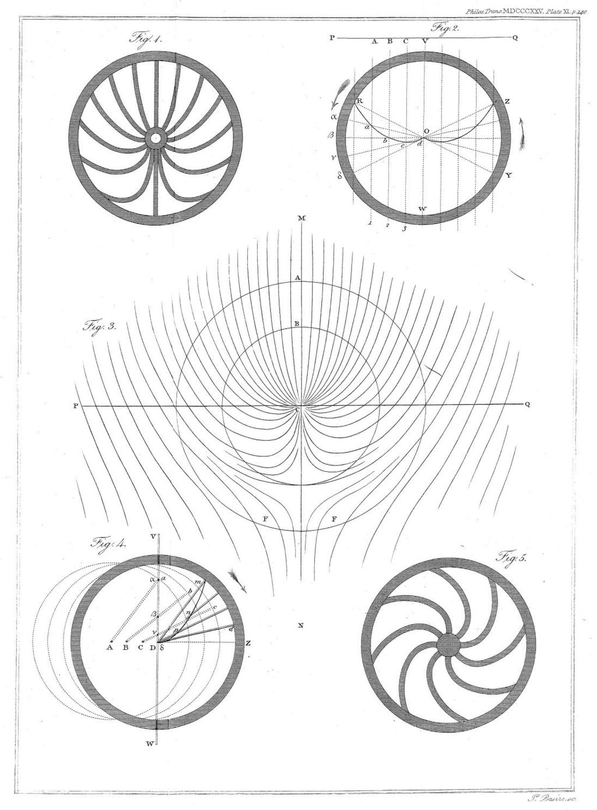

[Persistence of vision](https://en.wikipedia.org/wiki/Persistence_of_vision) is the idea that light and shapes still have an impression on our retina for a tiny amount of time after the moment it's encountered. 

## Definition & Use
Is the apparent motion caused by rapidly changing images. The idea originally was that the eyes still had some of the old motion in them by the time  the new light hit them. This is what allowed motion picture to feel like true motion.

## Discovery
(From wiki) it started when J.M. (author unkown) noticed line curvature of wheels and assumed the light was impressionable enough on the retina that it stay a little while

## Problems
The idea that the retina has an "impression" is likely false, and instead the image is most likely constructed in the [[mind]] in a [[gestalt]] sense. 

Another plausible explanation for motion perception is given as [[phi phenomenon]]

Epistemic status : #likely-false
