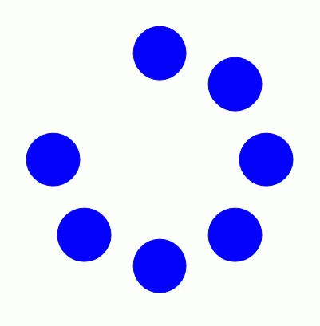

The [phi phenomenon](https://en.wikipedia.org/wiki/Phi_phenomenon) is the apparent perception of motion from the alternating flashing of stimuli. It looks like a shadow is going over the objects. 

Related [[beta movement]] is the opposite effect, where the mind creates a movements from objects in the foreground.

Epistemic status: #idk
