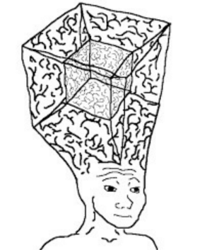

*[ [[Category - Anti-patterns]] ][ [[Category - Essays]] ]*

### The anti-pattern
Here’s a trend I find myself doing. Say I am trying to learn a new field, like [[Filmmaking techniques]] and I know another field pretty well, like [[Category - Computer Science | Computer Science]]. I look around, read some articles, watch some videos and think 

“Well, it looks like these fools don’t CODE. They don’t know TECH. I’m probably going to excel in this field, because I CODE.  Code can solve this. Enter *me*. Man, [[this industry won’t know what hit them]]. Nobody in this field has thought about the thing I’m thinking, because they’re in this field and I have such a unique perspective. Someone should really just [ automate](https://xkcd.com/1319/) this stuff.”

Maybe a bit caricaturesque but that’s the gist. I remember distinctly thinking that I had some sort of a unique advantage when it came to *literally any field* because of some unrelated technical expertise. 

The sheer arrogance of this line of thinking leads to one [[not appreciating a field]], and moreover is disrespectful to the masters of that particular field. 

That's not to say that there aren’t colloquial [magic bullets](https://www.merriam-webster.com/dictionary/magic%20bullet),  completely putting whoever wields it at a huge advantage. But they’re not going to *called* magic bullets, and you’ll only stumble upon them in delight.

### Solution
As always again, [[humility is the mind-saviour]]. Seek to [[appreciate, don't compete]]. Strive to [[combine fields]] well.
